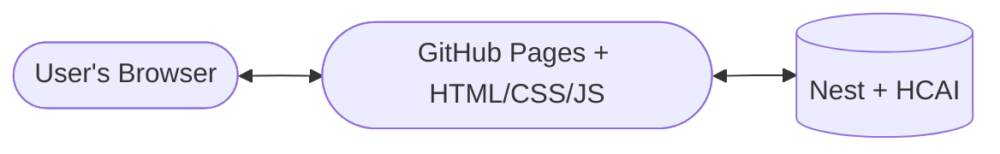

<h1 align="center"> 🤖 BobAI </h1>

> **BobAI** is your fun, website based AI chatbot.

## Why I made it?

The reason I made BobAI is that I've always wanted to build LLM chatbot myself, since I've been learning ML for more
than a year now.

## Project features

BobAI lives on a [website](https://oleksandr1dovbenko.github.io/BobAI/). On this website you can go to my GitHub
repository or try BobAI out.

### Bot features

- AI chatbot like **ChatGPT**, **Gemini**, **Claude**, **...**
- Main language: English
- Answers almost all your questions
- Web-search tool, to check real-time information

## Architecture

Building BobAI went through 3 different project architectures. Here are all of them:

### First: Fine-tuned model hosted on Hugging Face

- Model: **Llama 3.1 8B** using **UltraFeedback** dataset to fine-tune it
- Hosting: In GGUF format on HF
- Problem: Hugging Face discontinued any free containers 
(I also tried Oracle Cloud, but couldn't complete registration)

### Second: Fine-tuned model hosted on Nest

- Model: The exact same model
- Hosting: In GGUF format on Hack Club Nest
- Problem: Nest gives only 2GB of RAM and only 2 CPU cores, my model weights roughly 6 GB and my request for more RAM
  was rejected

### Final: HCAI API

- Model: **Gemini 2.5 Flash**
- Hosting: Light script on Hack Club Nest
- Result: Solved all the problems with RAM and cores

#### How does it work?

## How I made it?

I fine-tuned the model on my own with Unsloth and its documentation. I wrote the frontend with Claude's help and used it
less for the backend.