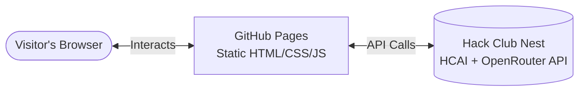

<h1 align="center">🤖 BobAI</h1>

  

> **BobAI** is a fun, intelligent AI assistant built for my website and powered by the HCAI API.

  ✨ <b><a href="https://oleksandr1dovbenko.github.io/BobAI/">Click here to try BobAI now!</a></b> ✨

---

## 📖 The Backstory

I finally started this project thanks to **Hack Club** and their **Stardance** event. I've wanted to build something like this for a long time, but something was always holding me back. This event gave me the perfect reason to just go for it! 🚀

---

## 🏗️ Architecture Evolution

Building **BobAI** went through a few architectural iterations to find the right balance between memory limits, hosting availability, and response speed.

### 1️⃣ Initial Plan: Self-Hosted Fine-Tuned Model

* **Model:** Fine-tuned **Meta Llama 3.1 8B** using the **UltraFeedback** dataset to fit my exact needs.
* **Hosting Idea (Hugging Face):** Originally intended to host a FastAPI backend with a GGUF model on Hugging Face Spaces, but free Docker containers were discontinued.

### 2️⃣ Intermediate Plan: Hack Club Nest + Custom Model

* **Hosting Idea (Nest):** Switched to **Hack Club Nest** to host the Python backend with the local model.
* **The Blocker:** Running the fine-tuned model required at least 5–6 GB of RAM. My application for 6 GB was declined due to server resource exhaustion, making it impossible to host the custom fine-tuned model directly on this setup.

### 3️⃣ Current Real Architecture

To guarantee smooth performance without hardware constraints, I transitioned the backend to an API-based architecture.

This reflects BobAI's real, current architecture, not the original plan.

---

## 🎨 Frontend & Design

A huge shoutout to Claude for helping me build the user interface of this project. To be completely honest, without Claude's assistance, the website would have been empty, boring, and ugly!